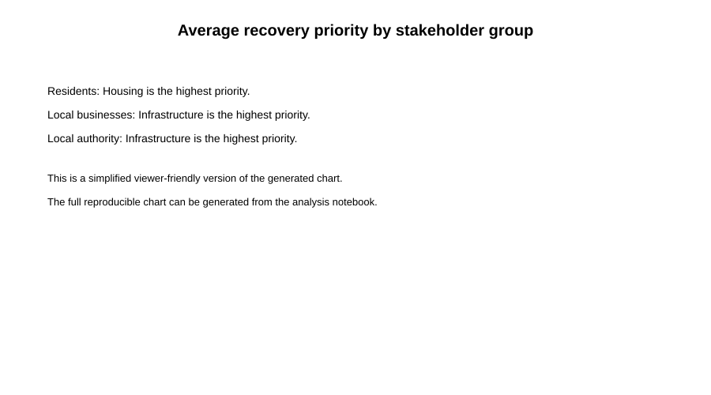
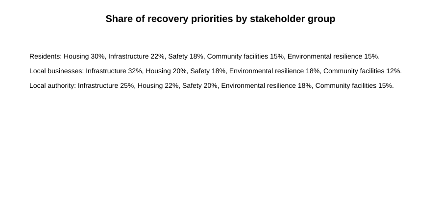

# Public Value Recovery Research

A reproducible portfolio research project exploring how communities and stakeholders prioritise post-crisis recovery in the built environment.

## Research question

Which built-environment priorities do communities value most during post-crisis recovery, and how do these priorities differ between stakeholder groups?

## Key findings

Using a simulated dataset of 240 anonymised responses:

- **Residents** ranked **housing** highest, with an average priority score of **2.18**.
- **Local businesses** ranked **infrastructure** highest, with an average priority score of **2.26**.
- **Local authorities** also ranked **infrastructure** highest, with an average priority score of **2.02**.
- Housing was especially important to residents, while infrastructure was the leading priority for both businesses and local authorities.

## Priority comparison





## Data

The project uses a **simulated, anonymised dataset** with 240 responses across three stakeholder groups:

- Residents
- Local businesses
- Local authority

The dataset and data dictionary are available in [`data/README.md`](data/README.md).

## Methods

Responses were grouped by stakeholder type and recovery category. Average priority scores were calculated for each group, then visualised using a grouped bar chart and a normalised heatmap.

## Limitations

The dataset is simulated for demonstration and portfolio purposes. It does not represent real community views and cannot support real-world policy claims. A real study would require ethical approval, informed consent, robust anonymisation and appropriate data governance.

## How to run

```bash
pip install -r requirements.txt
jupyter notebook
```

Then open:

```text
analysis/recovery_priorities_analysis.ipynb
```

## Repository structure

```text
public-value-recovery-research/
├── README.md
├── data/
│   ├── README.md
│   └── survey_responses.csv
├── analysis/
│   └── recovery_priorities_analysis.ipynb
├── visualisations/
│   ├── priorities_by_group.svg
│   └── priority_heatmap.svg
├── reports/
│   └── research_summary.md
├── requirements.txt
└── .gitignore
```

## Licence

This project is released under the [MIT Licence](LICENSE).
